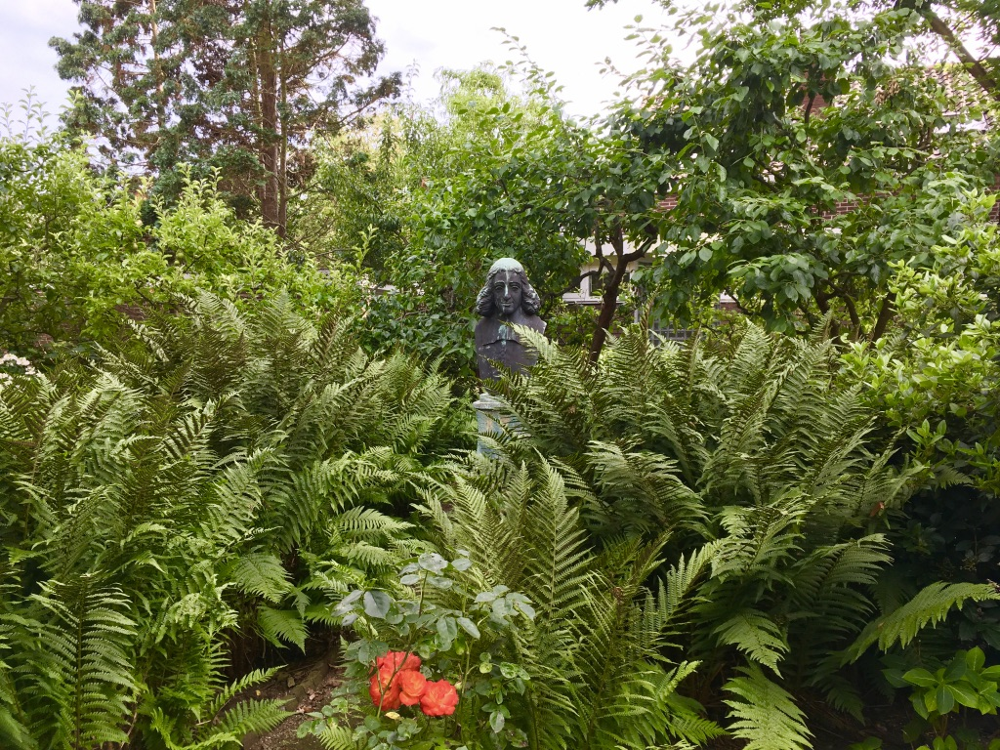

+++
widget = "blank"  # See https://sourcethemes.com/academic/docs/page-builder/
headless = true  # This file represents a page section.
active = true  # Activate this widget? true/false
weight = 100
[design]
  # Choose how many columns the section has. Valid values: 1 or 2.
  columns = "1"

+++

*My picture of Spinoza as a part of nature in Rijnsburg.*