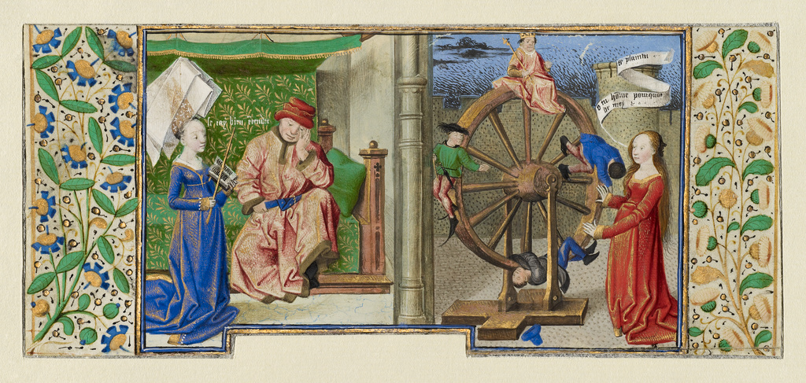

+++
widget = "blank"  # See https://sourcethemes.com/academic/docs/page-builder/
active = true  # Activate this widget? true/false
headless = true  # This file represents a page section.
# title = "Teaching"
# subtitle = ""
weight = 40
[design]
  # Choose how many columns the section has. Valid values: 1 or 2.
  columns = "1"
+++

*Philosophy Consoling Boethius and Fortune Turning the Wheel* [(Getty Museum)](http://www.getty.edu/art/collection/objects/127275/coetivy-master-henri-de-vulcop-philosophy-consoling-boethius-and-fortune-turning-the-wheel-french-about-1460-1470/).